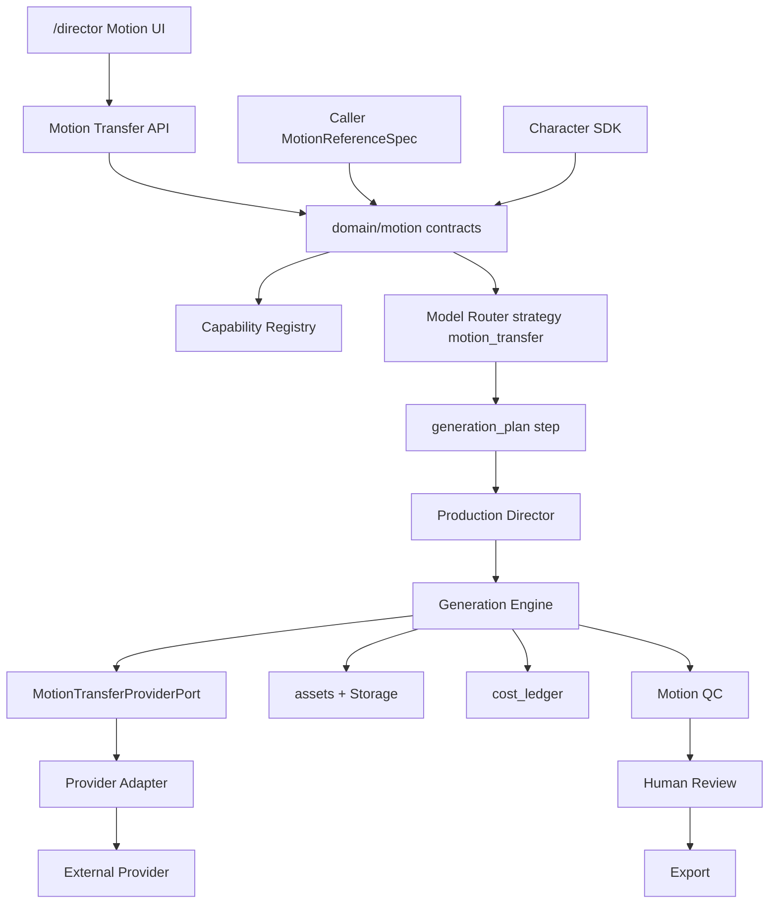
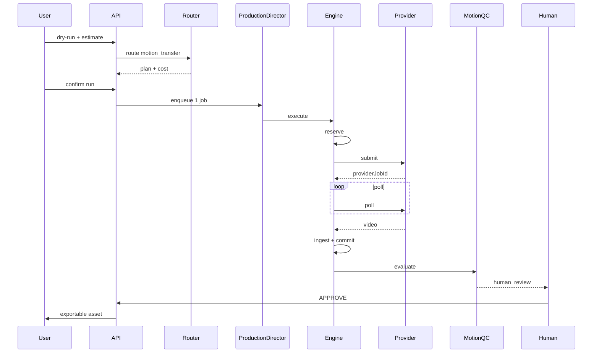
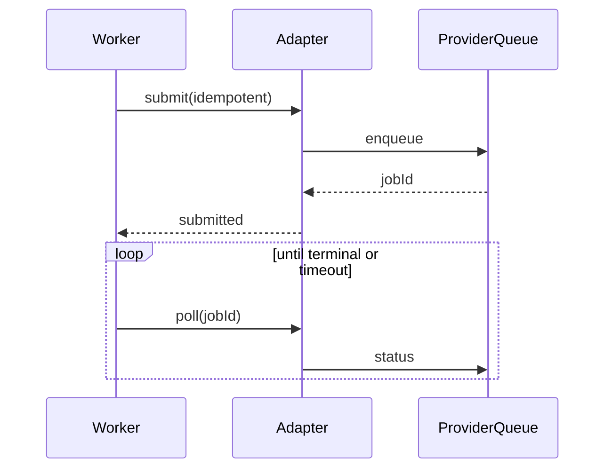
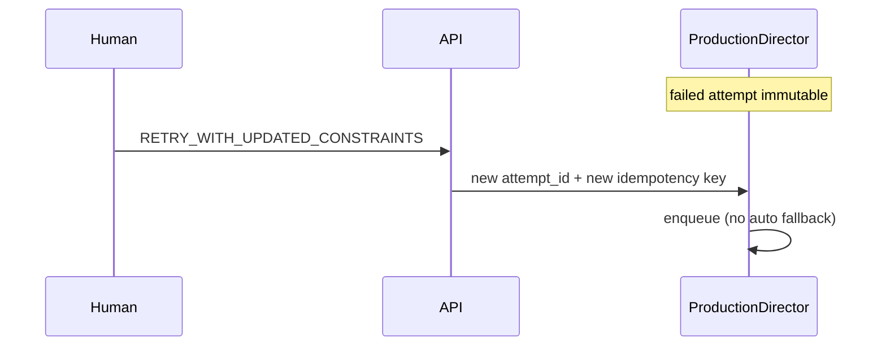
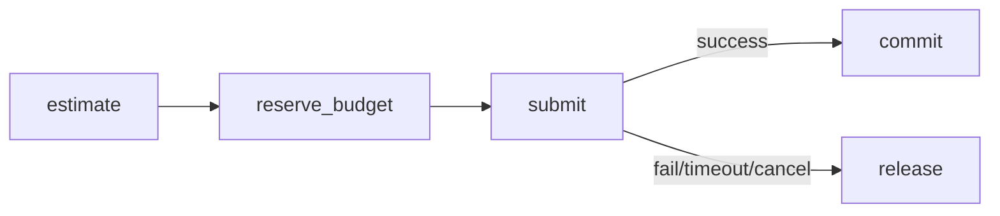
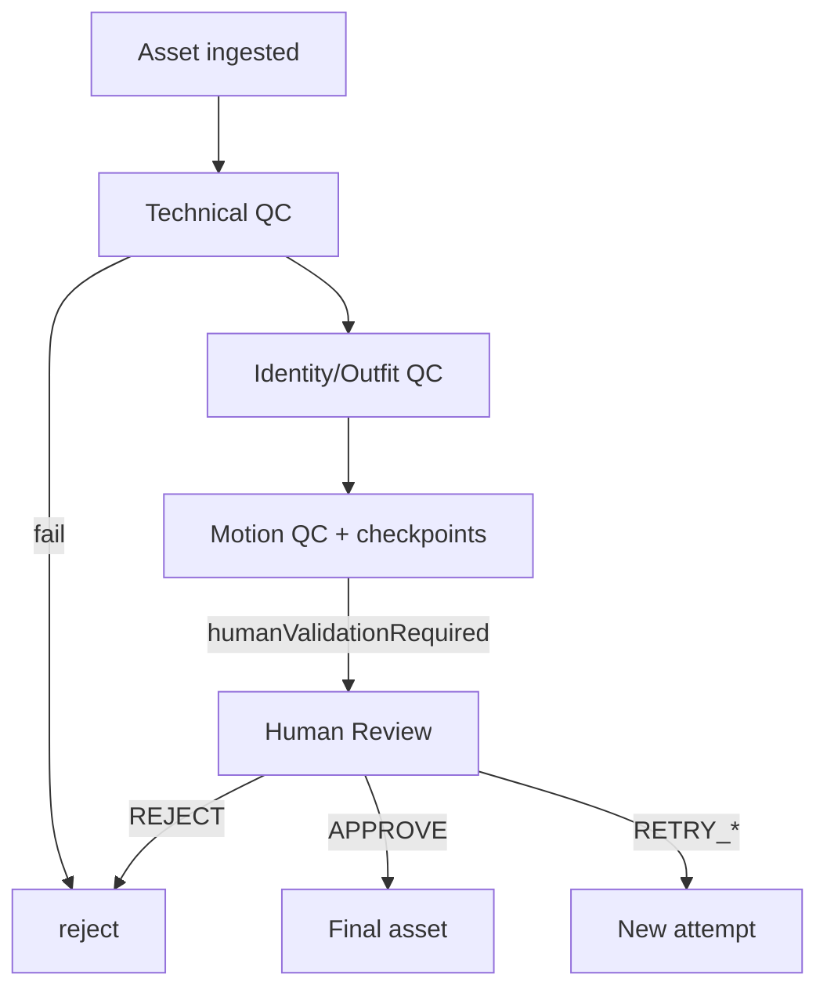
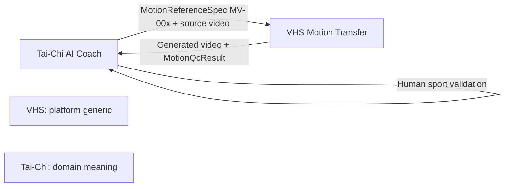

# 59 — Motion / Performance Transfer — Architecture

**Date :** 11 août 2026
**Capability :** `video.motion_transfer`
**Source de mission :** spécification utilisateur (fichier `VHS_MOTION_TRANSFER_REQUEST.md` non trouvé sur le disque au moment de la rédaction — contenu repris intégralement de la requête)

```text
ARCHITECTURE_READY_FOR_IMPLEMENTATION
MT-001 = IMPLEMENTED
Gate MT-1 = PASS
MT-002 = IMPLEMENTED
Gate MT-2 Registry portion = PASS
MT-003 = IMPLEMENTED
Gate MT-2 Router portion = PASS
MT-004 = IMPLEMENTED
Gate MT-3 Engine preparation = PASS
MT-005 = IMPLEMENTED
Gate MT-3 Persistence/Storage = PASS
MT-006 = IMPLEMENTED
Gate MT-4 Provider Port = PASS
MT-007A = IMPLEMENTED
Gate Provider Decision = PROVIDER_SELECTED_FOR_ADAPTER_IMPLEMENTATION
MT-007B+ = NOT STARTED
IMPLEMENTATION_NEXT = MT-007B fal Kling v3 Pro adapter (disabled)
remote migration MT-005 = NOT APPLIED
RUNTIME_NOT_IMPLEMENTED_YET
PROVIDER_SELECTED_FOR_ADAPTER_ONLY = fal / fal-ai/kling-video/v3/pro/motion-control
NO PAID BENCHMARK_YET
eligible Production motion-transfer models = 0
real provider adapters = 0
```

> Ce document est la **spécification d’architecture**. Les tickets MT-001…007A livrent contrats/code locaux ; aucun adapter réel ni appel payant n’est branché.

---

## 0. Statut et ordre d’implémentation

| Couche | Statut |
|---|---|
| Architecture | `ARCHITECTURE_READY_FOR_IMPLEMENTATION` |
| Domain contracts | **MT-001 IMPLEMENTED** — `studio/src/domain/motion/` · Gate MT-1 **PASS** |
| Capability Registry | **MT-002 IMPLEMENTED** — `capabilities/motion-transfer.ts` · Gate MT-2 Registry **PASS** · **0** modèle Production éligible |
| Model Router | **MT-003 IMPLEMENTED** — `routeMotionTransfer` · Gate MT-2 Router **PASS** · Production → `motion_capability_unavailable` |
| Generation Engine | **MT-004 IMPLEMENTED** — dry-run prepare · Gate MT-3 **PASS** · `providerCalled=false` · paid execution unavailable |
| Persistence / Storage | **MT-005 IMPLEMENTED** — `64_` · REUSE tables V2 · bucket `director-final-assets` · migration locale human_review **NOT APPLIED** Production |
| Provider port | **MT-006 IMPLEMENTED** — `65_` · `MotionTransferProviderPort` + fake TEST_ONLY · real adapters = 0 |
| Provider spike | **MT-007A IMPLEMENTED** — `66_` · selected fal Kling v3 Pro MC for **disabled** adapter only |
| Code runtime capability | `RUNTIME_NOT_IMPLEMENTED_YET` (still OFF / unavailable) |
| Provider | selected for adapter impl only — **not** Production-enabled |
| Benchmark payant | `NO PAID BENCHMARK_YET` |
| Prochaine action | **MT-007B** fal Kling adapter disabled-by-default |

**Ordre obligatoire :**

```text
Domain Contract
→ Registry
→ Router
→ Generation Engine
→ Provider Adapter
→ Motion QC
→ Human Review
→ Motion Director (éventuel, post-V1)
```

Le **Motion Director** n’est **pas** requis pour la V1. Il traduit des contraintes ; il n’invente jamais le mouvement.

---

## 1. Objectif plateforme

### Pipeline cible

```text
Reference Video
+ Character Identity
+ Outfit Reference
+ MotionReferenceSpec
+ Motion Constraints
+ Output Constraints
→ Motion Transfer Planning
→ Capability Routing
→ Provider Adapter
→ Generated Character Video
→ Technical QC
→ Identity QC
→ Motion QC
→ Human Review
→ Approval
→ Export
```

### Domaines d’usage (générique)

Tai-Chi · yoga · fitness · coaching sportif · formation professionnelle · tutoriels · démonstrations produit · marketing · éducation.

**Tai-Chi AI Coach** = premier **benchmark** (MV-001…003), **pas** une dépendance métier codée en dur dans VHS.

### Règle absolue

```text
I2V capability != motion_transfer capability
```

Aucun fallback silencieux I2V / T2V / downgrade modèle / relaxation identité.

---

## 2. Compatibilité avec l’architecture VHS actuelle

### 2.1 Matrice REUSE / EXTEND / NEW

| Composant VHS | Décision | Pourquoi |
|---|---|---|
| Character SDK (`runtime/character`) | **REUSE_AS_IS** | Identity / outfits Mei·Tom déjà abstraits |
| Identité Mei/Tom | **REUSE_AS_IS** | Instances SDK, jamais hardcodées métier |
| Outfit references | **REUSE_AS_IS** | `PromptReference.kind = outfit` + `AssetKind` |
| Capability Registry | **EXTEND** | Ajouter profil `video.motion_transfer` + champs motion |
| Model Router | **EXTEND** | Nouvelle stratégie `motion_transfer` ; scoring existant |
| Prompt Director | **EXTEND** | Intent + variant + refs source video |
| Production Director | **REUSE_AS_IS** | Runs/jobs/attempts génériques |
| Generation Engine | **EXTEND** | Nouveau kind d’input + validation |
| Provider ports (`ProviderAdapter`) | **EXTEND** | Port motion-transfer + adapter(s) |
| fal adapter async | **EXTEND** | Pattern submit/poll existant ; modèle motion non branché |
| production_runs / jobs / attempts | **REUSE_AS_IS** | Suffisants ; payload jsonb |
| Worker polling | **REUSE_AS_IS** | Modes execute/poll/cancel |
| Assets / Storage | **EXTEND** | Chemins source + QC evidence |
| Ledger / budget policies | **REUSE_AS_IS** | reserve/commit/release step |
| Kill switches | **EXTEND** | Flags dédiés `MOTION_TRANSFER_*` |
| Provenance / correlation | **REUSE_AS_IS** | `correlation_id` + `assets.provenance` |
| QC final (`quality_report`) | **EXTEND** | Checks motion + mapping `MotionQcResult` |
| Human review | **EXTEND** | Décisions enrichies (retry/constraints) |
| Merge / export | **REUSE_AS_IS** | Après approval humaine |
| Idempotence / retry humain | **REUSE_AS_IS** | Clés + `begin_or_retry_director_run` patterns |
| Artifact types DB CHECK | **NOT_APPLICABLE** | Pas de nouvel `ArtifactType` V1 |
| Motion Director | **NEW_COMPONENT_REQUIRED** | Post-V1 uniquement |
| Domain `MotionReferenceSpec` | **NEW_COMPONENT_REQUIRED** | Contrat appelant |
| Motion QC engine | **NEW_COMPONENT_REQUIRED** | Module domain + app |

### 2.2 Gaps critiques aujourd’hui (code)

- ~~`CapabilityProfileValues` : pas de `video.motion_transfer`~~ → **fermé MT-002** (profil + bloc `motionTransfer` + helpers).
- ~~`VideoGenerationInput` sans `sourceVideo`~~ → **fermé MT-004** (`MotionTransferCanonicalInput` + dry-run prepare).
- ~~Router : stratégie `motion_transfer` absente~~ → **fermé MT-003** (`routeMotionTransfer`, `maximumFallbacksPerStep=0`).
- Adapters : aucun modèle motion-control enregistré ; **0** entrée Production enabled.
- Human review : statuses `approved|rejected` seulement — **étendre** pour retry/constraints.

---

## 3. Domain Contract (versionné — prêt à coder)

**Emplacement cible :** `studio/src/domain/motion/`
**Schema version :** `motion-transfer-input-v1` / `MOTION_TRANSFER_SCHEMA_VERSION = "1.0.0"`

### 3.1 Types média (alignés dépôt)

Le dépôt n’a **pas** de type unique `MediaReference`. Convention VHS :

```ts
/** Alias documentaire = AssetInputRef existant (generation/input.ts). */
type MotionMediaReference = AssetInputRef;
// AssetInputRef = { assetId, kind, mimeType?, checksum?, access }
// access = internal | signed_url | data_url
```

Kinds à utiliser / étendre :

| Rôle | `AssetKind` |
|---|---|
| Vidéo source motion | `video` (existant) |
| Identité personnage | `character` |
| Tenue | `outfit` |
| Sortie générée | `video` / `step_output` |
| Preuve QC | nouveau kind optionnel `qc_evidence` **ou** provenance-only (décision MT-005) |

### 3.2 MotionTransferInput

```ts
export const MOTION_TRANSFER_SCHEMA_VERSION = "1.0.0" as const;

export type MotionFidelity = "standard" | "high" | "critical";
export type LockLevel = "required" | "preferred";
export type PoseControlMode = "provider_native" | "derived_pose" | "none";

export type MotionTransferCharacter = {
  characterId: string;
  identityReferences: AssetInputRef[]; // ≥1 si identityLock=required
  outfitReference?: AssetInputRef;
  identityLock: LockLevel;
  outfitLock?: LockLevel;
};

export type MotionTransferMotionParams = {
  preserveMotion: boolean; // must be true for this capability
  preserveTiming: boolean;
  preserveCamera?: boolean;
  fidelity: MotionFidelity;
  poseControl?: PoseControlMode;
};

export type MotionTransferOutputConstraints = {
  durationSeconds?: number;
  aspectRatio: string; // BriefAspectRatio when possible
  resolution?: "720p" | "1080p" | string;
  fps?: number;
};

export type MotionQcRequirement = {
  code: string; // e.g. "checkpoint.weight_transfer"
  severity: "blocking" | "warning";
  humanValidationRequired?: boolean;
};

export type MotionTransferInput = {
  schemaVersion: typeof MOTION_TRANSFER_SCHEMA_VERSION;
  sourceVideo: AssetInputRef;
  character: MotionTransferCharacter;
  motion: MotionTransferMotionParams;
  referenceSpec?: MotionReferenceSpec; // provided by calling project
  output: MotionTransferOutputConstraints;
  prompt?: string;
  negativeConstraints?: string[];
  qcRequirements: MotionQcRequirement[];
  correlationId: string;
  idempotencyKey: string;
};
```

### 3.3 MotionReferenceSpec (fourni par l’appelant)

VHS **ignore** la sémantique métier (noms Tai-Chi, etc.).

```ts
export const MOTION_REFERENCE_SPEC_SCHEMA_VERSION = "1.0.0" as const;

export type MotionPhase = {
  phaseId: string;
  order: number;
  title?: string;
  expectedDurationSeconds?: { min?: number; max?: number };
};

export type MotionCheckpoint = {
  checkpointId: string;
  phaseId: string;
  description: string; // opaque to VHS
  bodyFocus?: string[]; // opaque tags
  mandatory: boolean;
};

export type MotionBodyRelation = {
  relationId: string;
  description: string; // opaque
  mandatory: boolean;
};

export type MotionForbiddenPattern = {
  patternId: string;
  description: string;
  severity: "blocking" | "warning";
};

export type MotionTimingConstraint = {
  constraintId: string;
  description: string;
  preserveRelativeTiming: boolean;
};

export type MotionCameraConstraint = {
  constraintId: string;
  preserveCamera: boolean;
  notes?: string;
};

export type MotionReferenceSpec = {
  schemaVersion: typeof MOTION_REFERENCE_SPEC_SCHEMA_VERSION;
  movementId: string; // e.g. "MV-001" — opaque
  version: string;
  title: string;
  phases: MotionPhase[];
  checkpoints: MotionCheckpoint[];
  bodyRelations: MotionBodyRelation[];
  forbiddenPatterns: MotionForbiddenPattern[];
  timingConstraints: MotionTimingConstraint[];
  cameraConstraints: MotionCameraConstraint[];
  qcRequirements: MotionQcRequirement[];
  humanValidationRequired: boolean;
};
```

**Benchmark Tai-Chi (externes à VHS) :** `MV-001`, `MV-002`, `MV-003` — packagés par Tai-Chi AI Coach, jamais importés comme constantes VHS.

### 3.4 MotionTransferResult

```ts
export type MotionTransferResult = {
  schemaVersion: "1.0.0";
  status: "completed" | "failed" | "cancelled";
  asset?: AssetInputRef; // generated character video
  providerId: string;
  modelId: string;
  providerJobId?: string; // maps to assets.external_job_id / attempt
  usage?: { durationSeconds?: number; units?: number };
  costMinor?: number;
  provenance: Record<string, unknown>; // redacted-safe structured
  qc?: MotionQcResult;
  error?: MotionTransferError;
};
```

### 3.5 Erreurs normalisées

```ts
export type MotionTransferErrorCode =
  | "invalid_input"
  | "source_video_unavailable"
  | "identity_reference_unavailable"
  | "capability_unavailable"      // NEW — map Router no_eligible_strategy
  | "budget_exceeded"
  | "provider_unavailable"
  | "provider_rejected"
  | "timeout"
  | "cancelled"
  | "late_result_ignored"
  | "qc_rejected"
  | "human_rejected"
  | "adapter_not_found"
  | "model_not_supported"
  | "idempotency_conflict"
  | "kill_switch_blocked";
```

### 3.6 Idempotency contract

```text
key = projectId
    : motionTransfer
    : sourceVideo.assetId
    : character.characterId
    : referenceSpec.movementId@version | "none"
    : modelId
    : inputFingerprint
    : attemptN
```

- Submit provider : **au plus une fois** par attempt.
- Poll : jamais de resubmit.
- Replay commande : retourne `existing` si terminal.
- Runs failed : **immuables** ; retry = nouvel attempt / nouvelle clé.

---

## 4. Capability Registry — extension exacte

**Statut MT-002 :** **IMPLEMENTED** — rapport `61_MT002_MOTION_TRANSFER_CAPABILITY_REGISTRY.md`.

### 4.1 Nouveau profil

```ts
// CapabilityProfileValues +=
"video.motion_transfer"
```

**Interdit :** enregistrer un modèle I2V avec `supportedProfiles` incluant `video.motion_transfer` sans champs motion vérifiés.

### 4.2 Champs obligatoires (sous-objet versionné `motionTransfer`)

Implémenté (`studio/src/domain/routing/capabilities/motion-transfer.ts`) :

```ts
type SupportLevel = "SUPPORTED" | "PARTIAL" | "UNVERIFIED" | "NOT_SUPPORTED";

type MotionTransferModelCapabilities = {
  schemaVersion: "1.0.0";
  motionTransfer: true;              // discriminant
  sourceVideo: SupportLevel;
  characterReference: SupportLevel;
  outfitReference: SupportLevel;
  poseControl: PoseControlMode[];
  motionFidelityLevels: {
    standard: SupportLevel;
    high: SupportLevel;
    critical: SupportLevel;
  };
  timingPreservation: SupportLevel;
  cameraPreservation: SupportLevel;
  identityControl: SupportLevel;
  outfitControl: SupportLevel;
  fullBodySupport: SupportLevel;
  handFootQuality: SupportLevel;
  minDurationSeconds?: number;
  maxDurationSeconds: number;
  aspectRatios: AspectRatio[];
  resolutions: string[];
  fps: number[];
  syncOrAsync: "sync" | "async";
  pollingRequired: boolean;
  cancellationSupported: boolean;
  estimateStrategy: "per_second" | "per_job" | "minimum_then_per_second";
};
```

Coûts : `ModelCapabilities.pricing` (`PricingDefinition` / Money) — **pas** de prix non vérifié ajouté en Production.
Media input : `source_video` ajouté à `MediaInputTypeValues`.

### 4.3 Validation

- `motionTransfer !== true` / bloc absent → ineligible.
- Profil `video.motion_transfer` sans bloc → schema invalid.
- `sourceVideo` ≠ `SUPPORTED` → hard-ineligible.
- `UNVERIFIED` / `PARTIAL` ne satisfont jamais les hard constraints payantes ; `critical` exige `SUPPORTED`.
- I2V / T2V / reference-images seuls : **incompatibles**.
- Production : **0** modèle motion-transfer enabled.

### 4.4 Exemple compatible (candidat — NON sélectionné)

```text
providerId: fal
modelId: kling-v3-pro-motion-control
externalModelId: fal-ai/kling-video/v3/pro/motion-control
supportedProfiles: [video.motion_transfer]
mediaInputs: [image, video, text]
motionTransfer: true
sourceVideo: true
characterReference: true
syncOrAsync: async
maxDurationSeconds: 30 (orientation=video) | 10 (orientation=image)
evidence: provider_documentation (fal) — confidence: medium until spike
status: unavailable until Gate MT-5
enabled: false
```

### 4.5 Exemple I2V incompatible

```text
providerId: fal
modelId: e2e-i2v / kling-i2v
supportedProfiles: [video.image_to_video]
mediaInputs: [image, text, start_frame]
motionTransfer: ABSENT
→ MUST NOT route for video.motion_transfer
```

---

## 5. Model Router — stratégie `motion_transfer`

**Statut MT-003 :** **IMPLEMENTED** — rapport `62_MT003_MOTION_TRANSFER_ROUTER.md`.

### 5.1 Strategy id

```ts
// GenerationStrategyId +=
"motion_transfer"
```

Template : **1 step** unique `video.motion_transfer` — pas de chaîne I2V+T2V.
Entrée pure : `routeMotionTransfer(request)` (intents scène non branchés — `supportedProductionIntents: []`).

### 5.2 Hard constraints (eligibility)

| Constraint | Rule |
|---|---|
| sourceVideo | obligatoire, MIME video, access usable |
| motion.preserveMotion | `true` |
| motion.fidelity | model supports level |
| identityLock=required | model.identityControl ∧ refs≥1 |
| outfitLock=required | model.outfitControl ∧ outfit ref |
| fullBody | si spec/qc l’exige → model.fullBodySupport |
| hands/feet | si qc blocking → handFootQuality known & ≥ seuil policy |
| timing | preserveTiming ⇒ model.timingPreservation |
| duration | within model.maxDurationSeconds |
| aspectRatio / resolution | intersection non vide |
| budget | estimate ≤ available (+ policy) |
| provider allowlist | flag `MOTION_TRANSFER_PROVIDER_<NAME>_ENABLED` |
| geo/privacy | `regions` + policy projet |

### 5.3 Scoring secondaire

Réutiliser `CapabilityScores` + poids policy :

coût · qualité · délai · fiabilité · identité · temporal consistency (nouveau score optionnel `temporalConsistency?`).

### 5.4 Interdits

```text
silent fallback to I2V
silent fallback to T2V
silent model downgrade
silent identity relaxation
maximumFallbacksPerStep must be 0 for motion_transfer V1
```

### 5.5 Absence de modèle

```text
routeMotionTransfer → status=failed
failure.code → motion_capability_unavailable
selected candidate → none
Director/API mapping (futur) → needs_input | failed (policy)
```

---

## 6. Generation Engine

**Statut MT-004 :** **IMPLEMENTED** — rapport `63_MT004_MOTION_TRANSFER_GENERATION_ENGINE.md`.
Action discriminante : `motion_transfer` (MediaAction + kind). Entrée : `runMotionTransferGenerationDryRun`.

### 6.1 Extension CanonicalGenerationInput

```ts
export type MotionTransferCanonicalInput = CommonInput & {
  kind: "motion_transfer";
  action: "motion_transfer";
  capabilityProfile: "video.motion_transfer";
  durationSeconds: number;
  sourceVideo: AssetInputRef;
  identityReferences: AssetInputRef[];
  outfitReference?: AssetInputRef;
};
// Engine request wraps MotionTransferInput (MT-001) + budget/allowlists — see motion-transfer-prepare.ts
```

### 6.2 Pipeline d’exécution

```text
validate
→ resolve media (signed URLs / internal)
→ route (already decided in plan) OR assert step model
→ estimate
→ reserve
→ submit (idempotent)
→ poll
→ normalize
→ persist asset
→ reconcile ledger (commit/release)
→ QC (technical + motion)
→ human gate
```

Dry-run : toutes les étapes sauf submit réseau / ledger write réelle (estimate only).

---

## 7. Provider Port

### 7.1 Interface (provider-agnostic)

```ts
export interface MotionTransferProviderPort {
  readonly providerId: string;
  readonly supportedModelIds: readonly string[];

  estimate(input: MotionTransferInput): Promise<MotionTransferEstimate>;
  submit(input: MotionTransferInput): Promise<MotionTransferSubmission>;
  poll(jobId: string): Promise<MotionTransferStatus>;
  cancel?(jobId: string): Promise<MotionTransferCancelResult>;
}
```

Compatibilité avec `ProviderAdapter` existant : adapter motion **implémente** `ProviderAdapter` (submit/poll/cancel/estimate) **et** expose le port typé ci-dessus en façade domain.

### 7.2 Contrats opérationnels

| Sujet | Règle |
|---|---|
| Submit idempotent | même `idempotencyKey` → même `providerJobId` / existing |
| providerJobId | stocké sur attempt + `assets.external_job_id` |
| Polling | worker mode `poll` ; backoff borné ; **no resubmit** |
| Terminal | completed / failed / cancelled |
| Timeout | policy par modèle ; fail + release reservation |
| Cancel | best-effort ; si non supporté → abandon poll + ignore late |
| Late result | si flags OFF ou job terminal autre → `late_result_ignored` + audit |
| Errors | map → `MotionTransferErrorCode` |
| Usage/cost | normalisés minor units |
| Provenance | provider, model, external ids, input asset ids (pas d’URL signée) |
| Ingestion | download → Storage privé → `assets` row |

---

## 8. Provider Evaluation (spike documentaire — 0 paid)

### 8.1 Matrice

Légende : `SUPPORTED` · `PARTIAL` · `UNVERIFIED` · `NOT_SUPPORTED`

| Critère | fal Kling Motion Control (v3 pro/std, v2.6) | fal I2V générique | OpenAI video | ElevenLabs |
|---|---|---|---|---|
| Vraie vidéo source | **SUPPORTED** (docs `video_url`) | NOT_SUPPORTED | UNVERIFIED / N/A | NOT_SUPPORTED |
| Motion transfer réel | **PARTIAL→UNVERIFIED** (marketing+API schema) | NOT_SUPPORTED | NOT_SUPPORTED | NOT_SUPPORTED |
| Motion fidelity | UNVERIFIED | NOT_SUPPORTED | — | — |
| Full-body | PARTIAL (docs claim) | — | — | — |
| Mains / pieds | UNVERIFIED | — | — | — |
| Timing | UNVERIFIED | — | — | — |
| Identité (image ref) | PARTIAL (`image_url` + element binding claim) | PARTIAL | — | — |
| Tenue | UNVERIFIED (via image) | — | — | — |
| Contrôle caméra | PARTIAL (`character_orientation` image/video) | — | — | — |
| Durée | PARTIAL (10s image / 30s video orient.) | — | — | — |
| Résolution | PARTIAL (docs tiers) | — | — | — |
| API async queue | **SUPPORTED** (fal queue) | SUPPORTED | — | — |
| Coût | PARTIAL (publié $/s — non benchmarké ici) | — | — | — |
| Restrictions / commercial | PARTIAL (fal commercial use claim) | — | — | — |
| Suppression médias provider | UNVERIFIED | UNVERIFIED | — | — |
| Geo / privacy | UNVERIFIED | — | — | — |

**Sources :** documentation publique fal (`fal-ai/kling-video/v3/pro/motion-control`) — **confidence medium** jusqu’au spike contrôlé.

### 8.3 Verdict évaluation

```text
PROVIDER_SELECTED_FOR_ADAPTER_IMPLEMENTATION (MT-007A — 2026-08-11)
  primary = fal / fal-ai/kling-video/v3/pro/motion-control
  cost alternate = fal / fal-ai/kling-video/v2.6/standard/motion-control
PROVIDER_SPIKE = DONE (documentary + static mapping; 0 provider calls)
NO PAID BENCHMARK_YET
enabled Production = false
```

Preuves : docs officielles fal llms.txt/API — détail `66_`. Aucun appel provider.

---

## 9. Production Jobs — modèle d’exécution

### 9.1 Mapping sur tables existantes

| Concept doc | Table / artifact réel | Action |
|---|---|---|
| MotionTransferRun | `production_runs` (+ `director_runs` type production si via `/director`) | **REUSE** |
| MotionTransferJob | `production_jobs` | **REUSE** — `payload` contient motion input fingerprint |
| MotionTransferAttempt | `generation_attempts` | **REUSE** |
| MotionTransferAsset | `assets` | **REUSE** + provenance |
| MotionQcRun | projection dans `quality_report` value **ou** jsonb job result | **EXTEND** value schema |
| HumanReviewDecision | `human_review_decisions` | **EXTEND** statuses (migration) |

**V1 recommandation :** **pas** de nouvelles tables `motion_*` si le payload + quality_report suffisent.
**V1.1 éventuel :** table `motion_qc_runs` si volumétrie/audit l’exige (ticket séparé).

### 9.2 Statuts / transitions

Réutiliser machines existantes (`pending→…→completed|failed|cancelled`).
Contraintes V1 motion :

- `maximumFallbacksPerStep = 0`
- retry = **humain** seulement
- failed attempts immuables

### 9.3 Polling / timeout / cancel / orphans

| Sujet | Design |
|---|---|
| Polling | worker `poll` + lease heartbeat |
| Timeout | `payload.timeoutAt` ; fail_production_job |
| Cancel | `cancel` adapter si supporté + job cancelled |
| Orphan recovery | reclaim expired_lease ; never double submit |
| Late completion | ignore if terminal/flags OFF ; audit `late_result_ignored` |
| Cleanup | delete provider temp URLs after ingest ; retention policy §14 |

---

## 10. Supabase / migrations (design — **ne pas créer maintenant**)

### 10.1 Réutilisé sans changement

`workspaces`, `workspace_budget_policies`, `video_projects`, `project_artifacts`, `active_artifact_revisions`, `generation_plans`, `production_runs`, `production_jobs`, `generation_attempts`, `cost_ledger`, `budget_reservations`, `idempotency_records`, `domain_events`, `assets`, `audit_log`, bucket `director-final-assets`.

### 10.2 Changements proposés (tickets)

| Ticket | Changement |
|---|---|
| MT-005a | Aucune table obligatoire V1 |
| MT-005b | **DONE local** — CHECK élargi sur `human_review_decisions.decision` (+ retry intents) — remote **NOT APPLIED** |
| MT-005c | Index optionnel `(external_job_id)` partial unique where not null sur `generation_attempts` ou `assets` |
| MT-005d | Storage paths convention (pas de SQL) |
| MT-005e | RPC : **aucune** nouvelle RPC obligatoire V1 |

RLS : inchangé (service_role only).
Ledger : inchangé.
Audit : events metadata `capability=video.motion_transfer`.

---

## 11. Storage et confidentialité

### 11.1 Classes d’objets

| Classe | Bucket | Path pattern |
|---|---|---|
| source video | `director-final-assets` (ou sous-préfixe) | `{workspace}/{project}/motion/source/{assetId}.mp4` |
| identity refs | idem | `{workspace}/{project}/motion/identity/{assetId}.png` |
| outfit refs | idem | `{workspace}/{project}/motion/outfit/{assetId}.png` |
| provider output | idem | `{workspace}/{project}/motion/output/{assetId}.mp4` |
| QC evidence | idem | `{workspace}/{project}/motion/qc/{assetId}.*` |
| approved final | idem | `{workspace}/{project}/final/{assetId}.mp4` |

### 11.2 Règles

- Buckets **privés** ; accès signed URL courte.
- Checksum + MIME + taille max (policy) à l’ingest.
- Consentement / licence : métadonnées projet (champs brief ou sidecar) — **à brancher** MT-011.
- Suppression provider : best-effort post-ingest ; documenter UNVERIFIED jusqu’au spike.
- Données biométriques potentielles (visage, corps) : minimisation logs ; **jamais** logger frames.
- Rétention : alignée VHS-206 (futur) ; V1 = pas de purge auto.
- Logs redacted : URLs signées, bytes, prompts complets, réponses brutes.

---

## 12. Motion QC

### 12.1 Couches

```text
Technical QC
Identity QC
Outfit QC
Motion Fidelity QC
Body Integrity QC
Temporal Consistency QC
Camera Compliance QC
Project-Specific QC  (via MotionReferenceSpec — opaque evaluation hooks)
Human Review
```

### 12.2 Contrat

```ts
export type QcStatus = "pass" | "fail" | "unknown" | "skipped";

export type MotionCheckpointResult = {
  checkpointId: string;
  status: QcStatus;
  notes?: string;
};

export type MotionQcIssue = {
  code: string;
  severity: "blocking" | "warning";
  message: string; // no PII / no media
};

export type MotionQcResult = {
  schemaVersion: "1.0.0";
  motionFidelity: QcStatus;
  identityFidelity: QcStatus;
  outfitFidelity: QcStatus;
  cameraCompliance: QcStatus;
  bodyIntegrity: QcStatus;
  temporalConsistency: QcStatus;
  checkpointResults: MotionCheckpointResult[];
  issues: MotionQcIssue[];
  overallStatus: "pass" | "retry" | "human_review" | "reject";
  humanValidationRequired: boolean;
};
```

### 12.3 Automatisable V1 vs humain

| Check | V1 auto | Humain |
|---|---|---|
| Technical (MIME, durée, non-vide, decode) | **oui** | — |
| Identity embedding / face match | optionnel / unknown | **oui** si lock required |
| Outfit | unknown / heuristic | **oui** si lock required |
| Motion fidelity / checkpoints | **unknown** sauf hooks projet | **oui** si `humanValidationRequired` |
| Body integrity (mains/pieds) | unknown | **oui** (Tai-Chi) |
| Temporal / phases order | partial si timestamps spec | **oui** |
| Camera | partial si metadata | **oui** |

### 12.4 Tai-Chi checklist (project-specific — hors VHS core)

Fournies via `MotionReferenceSpec` MV-001… : pieds · genoux · transfert du poids · bassin · mains · buste · timing · ordre des phases · mouvements interdits.
VHS exécute les `qcRequirements` / checkpoints comme **contrats opaques** + gate humain.

---

## 13. Human Review Gate

### 13.1 Décisions cibles

```text
APPROVE                         → approved (existant)
REJECT                          → rejected (existant)
RETRY_WITH_SAME_REFERENCE       → NEW status / action
RETRY_WITH_UPDATED_CONSTRAINTS  → NEW
REQUEST_NEW_REFERENCE           → NEW
```

### 13.2 Règle

Si `referenceSpec.humanValidationRequired === true` **ou** `MotionQcResult.humanValidationRequired` :

```text
aucun asset motion-transfer ne devient final / exportable sans décision APPROVE
```

Mapping export : uniquement après `approved` + non-waivable technical codes vides (existant).

---

## 14. API et UI (contrats — non codés)

### 14.1 Endpoints proposés

| Method | Path | Rôle |
|---|---|---|
| POST | `/api/director/projects/:id/motion-transfer/source` | upload/attach source video |
| PUT | `/api/director/projects/:id/motion-transfer/character` | character + identity/outfit |
| PUT | `/api/director/projects/:id/motion-transfer/spec` | attach MotionReferenceSpec JSON |
| POST | `/api/director/projects/:id/motion-transfer/dry-run` | validate+route+estimate |
| POST | `/api/director/projects/:id/motion-transfer/estimate` | cost only |
| POST | `/api/director/projects/:id/motion-transfer/runs` | create run (Auth+flags) |
| GET | `/api/director/projects/:id/motion-transfer/runs/:runId` | status |
| POST | `/api/director/projects/:id/motion-transfer/runs/:runId/cancel` | cancel |
| GET | `/api/director/projects/:id/motion-transfer/runs/:runId/qc` | MotionQcResult |
| POST | `/api/director/projects/:id/motion-transfer/runs/:runId/review` | human decision |
| POST | `/api/director/projects/:id/motion-transfer/runs/:runId/retry` | human retry |
| GET | `/api/director/projects/:id/export` | reuse export after approve |

Tous : auth fail-closed · CSRF · redaction · idempotency-key header.

### 14.2 Écrans `/director`

1. Source video picker/upload
2. Character + outfit
3. Spec selector (JSON / library externe)
4. Dry-run + estimate
5. Confirm (budget)
6. Progress (job states)
7. Preview player
8. Motion QC panel
9. Human review actions
10. Retry / export

---

## 15. Kill switches et budget

### 15.1 Flags (OFF par défaut)

```text
MOTION_TRANSFER_ENABLED
MOTION_TRANSFER_PAID_ENABLED
MOTION_TRANSFER_WORKER_ENABLED
MOTION_TRANSFER_PROVIDER_FAL_ENABLED
# pattern: MOTION_TRANSFER_PROVIDER_<NAME>_ENABLED
```

Composition exécution payante :

```text
MOTION_TRANSFER_ENABLED
∧ MOTION_TRANSFER_PAID_ENABLED
∧ MOTION_TRANSFER_WORKER_ENABLED
∧ MOTION_TRANSFER_PROVIDER_<NAME>_ENABLED
∧ DIRECTOR_V2_ENABLED (si surface /director)
∧ !other conflicting kill switches
```

### 15.2 Budget

- Pricing registry : coût / seconde (ou / job) — evidence required.
- Plafond workspace (`workspace_budget_policies`) + plafond par run (policy).
- Flow : estimate → reserve → commit|release.
- V1 : **max 1** provider call / attempt ; **max 1** attempt auto ; retries humains only.
- Timeout borné ; **aucun** fallback automatique.

---

## 16. Observabilité

### 16.1 Événements

estimate · reserve · submit · provider_accepted · poll · completed · failed · cancelled · late_result · asset_ingested · qc · human_decision · ledger_commit · ledger_release

### 16.2 Champs obligatoires

```text
correlationId, runId, jobId, attempt,
provider, model, prompt/contract version,
duration, usage, cost, terminal status
```

### 16.3 Redaction

vidéos · images · URLs signées · clés · prompts complets · biométrie · réponses provider brutes

---

## 17. Motion Director (post-V1)

| | |
|---|---|
| Rôle futur | Traduire contraintes projet → `MotionTransferInput` + QC hooks |
| Non-rôle | Inventer le mouvement ; appeler un provider ; bypass Router |
| Emplacement | `application/directors/motion/` **après** Gates MT-0…MT-10 |
| Ticket | MT-014 evaluation only |

---

## 18. Diagrammes

### 18.1 Composants



### 18.2 Happy path



### 18.3 Provider async



### 18.4 Fail / retry humain



### 18.5 Budget / ledger



### 18.6 QC / human approval



### 18.7 Frontières Tai-Chi / VHS



---

## 19. Tickets d’implémentation (Cursor-ready)

### MT-001 — Domain contracts

- **Objectif :** Zod + TS `MotionTransferInput`, `MotionReferenceSpec`, `MotionQcResult`, errors, schema versions.
- **Fichiers :** `studio/src/domain/motion/**`.
- **Dépendances :** aucune.
- **Acceptation :** types exportés ; validation fail-closed ; tests table-driven.
- **Interdit :** provider, DB, flags ON.
- **DoD :** unitaires verts ; doc §3 respectée.

### MT-002 — Capability Registry — **IMPLEMENTED**

- **Objectif :** profil `video.motion_transfer` + `MotionTransferModelCapabilities` + validation anti-I2V.
- **Fichiers :** `capability-profiles.ts`, `capabilities/motion-transfer.ts`, `model.ts`, `schemas.ts`, fixtures SYNTHETIC.
- **Dépendances :** MT-001.
- **Acceptation :** I2V/T2V ineligible ; helpers purs ; **0** Production enabled — **PASS** (`61_`).
- **Interdit :** enable Production models — respecté.
- **DoD :** tests registry + eligibility — **PASS**.

### MT-003 — Router strategy — **IMPLEMENTED**

- **Objectif :** stratégie `motion_transfer`, hard constraints, `maximumFallbacksPerStep=0`, map `capability_unavailable`.
- **Fichiers :** `strategies.ts`, `strategy-library.ts`, `motion-transfer-routing.ts`, errors.
- **Dépendances :** MT-002.
- **Acceptation :** no silent I2V/T2V ; Production → `motion_capability_unavailable` — **PASS** (`62_`).
- **Interdit :** fallback auto — respecté.
- **DoD :** tests stratégie + scoring — **PASS**.

### MT-004 — Generation Engine — **IMPLEMENTED**

- **Objectif :** `MotionTransferGenerationInput` + validate/resolve/normalize.
- **Fichiers :** `motion-transfer-prepare.ts`, `motion-transfer-media.ts`, `input.ts`, validation.
- **Dépendances :** MT-001…003.
- **Acceptation :** dry-run sans réseau ; sourceVideo obligatoire — **PASS** (`63_`).
- **Interdit :** submit réel — respecté (`providerCalled=false`).
- **DoD :** unitaires + dry-run — **PASS**.

### MT-005 — Supabase / storage — **IMPLEMENTED**

- **Objectif :** conventions paths ; migration locale human_review **decision** intents ; provenance roles.
- **Fichiers :** `domain/motion/persistence.ts`, `application/motion/*`, migration `vhs_mt005_*`, rapport `64_`.
- **Dépendances :** MT-001…004.
- **Acceptation :** REUSE tables V2 ; bucket privé réutilisé ; Gate MT-3 Persistence/Storage **PASS**.
- **Interdit :** apply distant / purge destructive — respecté (`remote migration = NOT APPLIED`).
- **DoD :** pgTAP + unitaires + docs 17_ — voir `64_`.

### MT-006 — Provider port — **IMPLEMENTED**

- **Objectif :** `MotionTransferProviderPort` + fake adapter.
- **Fichiers :** `domain/motion/provider-port.ts`, `infrastructure/providers/motion-transfer/*`, rapport `65_`.
- **Dépendances :** MT-001…005.
- **Acceptation :** fake submit/poll/cancel/estimate ; idempotence ; contract suite — **PASS**.
- **Interdit :** clé provider réelle / réseau — respecté.
- **DoD :** tests fake + contract suite — **PASS**.

### MT-007A — Provider capability spike *(DONE 2026-08-11)*

- **Objectif :** sélection documentaire du premier provider Motion Transfer — **PASS**.
- **Verdict :** `PROVIDER_SELECTED_FOR_ADAPTER_IMPLEMENTATION`.
- **Sélection :** `fal` / `fal-ai/kling-video/v3/pro/motion-control` (cost alternate v2.6 standard).
- **Artefacts :** `66_`, mapping plan + tests spike — **aucun appel provider**.
- **Interdit respecté :** NO PROVIDER CALL / NO SECRET / NO GENERATION.

### MT-007B — First provider adapter (disabled)

- **Objectif :** adapter fal Kling motion-control **disabled** by default (`enabled=false`, unpaid).
- **Dépendances :** MT-006, MT-007A, Gate Provider Decision.
- **Acceptation :** bind schema ; enabled=false ; kill switch ; contract-suite feasibility.
- **Interdit :** paid call / submit réel sans Auth Gate MT-7/8.
- **DoD :** characterization tests sans réseau.

### MT-008 — Worker / polling

- **Objectif :** job payload motion ; poll/timeout/late_result ; flags.
- **Dépendances :** MT-004, MT-006.
- **Acceptation :** 1 job ; no resubmit ; orphan recovery.
- **Interdit :** cron ; multi-job auto.
- **DoD :** integration fake worker.

### MT-009 — Motion QC

- **Objectif :** `MotionQcResult` pipeline + technical checks + opaque checkpoint pass-through.
- **Dépendances :** MT-001, MT-008.
- **Acceptation :** humanValidationRequired honoré.
- **Interdit :** auto-approve.
- **DoD :** unitaires QC.

### MT-010 — Human review UI/API

- **Objectif :** endpoints + UI décisions étendues.
- **Dépendances :** MT-009, MT-005b.
- **Acceptation :** pas de final sans APPROVE si required.
- **Interdit :** alert/confirm natifs.
- **DoD :** E2E fake review.

### MT-011 — Observability / security

- **Objectif :** events, redaction, consent metadata, target guard.
- **Dépendances :** MT-008.
- **Acceptation :** secret scan ; no signed URL in logs.
- **Interdit :** raw provider payloads in logs.
- **DoD :** tests redaction.

### MT-012 — Dry-run and tests

- **Objectif :** suite complète fake : registry→router→engine→worker→QC→review.
- **Dépendances :** MT-001…011.
- **Acceptation :** 0 provider ; unit+integration verts.
- **Interdit :** paid.
- **DoD :** checklist qualité locale.

### MT-013 — Controlled benchmark MV-001

- **Objectif :** 1 call max Auth ; Tai-Chi MV-001 ; human approve.
- **Dépendances :** Gates MT-5…MT-10, budget Auth.
- **Acceptation :** preuve bornée ; flags OFF après.
- **Interdit :** chaîne marketing ; fallback ; multi-movement.
- **DoD :** rapport smoke + ledger reconcile.

### MT-014 — Motion Director evaluation

- **Objectif :** décider si Director dédié nécessaire.
- **Dépendances :** après MT-013.
- **Acceptation :** ADR keep/postpone.
- **Interdit :** implémentation spéculative.
- **DoD :** note ADR dans handover.

---

## 20. Portes de déploiement

```text
Gate MT-0  Architecture approved          ← ce document
Gate MT-1  Domain contracts
Gate MT-2  Registry/Router
Gate MT-3  Engine/DB
Gate MT-4  Adapter fake
Gate MT-5  Provider capability spike      (PROVIDER_SPIKE_REQUIRED)
Gate MT-6  Dry-run
Gate MT-7  Budget authorization
Gate MT-8  MV-001 controlled benchmark
Gate MT-9  Motion QC
Gate MT-10 Human approval
Gate MT-11 Production readiness
```

Chaque gate : flags OFF par défaut ; Auth humaine pour paid ; backup P1 respecté si opération invasive.

---

## 21. Definition of Done (capability)

La capability `video.motion_transfer` n’est **terminée** que si :

- [ ] contrat domaine versionné
- [ ] Registry + Router réels
- [ ] `sourceVideo` réellement transmis au provider
- [ ] identité et tenue transmises quand lock required
- [ ] adapter opérationnel sous kill switch
- [ ] jobs idempotents
- [ ] polling / cancel / timeout
- [ ] coûts observables (ledger)
- [ ] kill switches OFF-by-default
- [ ] Storage privé
- [ ] Motion QC
- [ ] human review
- [ ] benchmark MV-001 approuvé
- [ ] **aucun** fallback I2V silencieux
- [ ] documentation + tests complets

---

## 22. Éléments encore à décider (humain)

1. Provider/model exact post-spike (Gate MT-5).
2. `MediaAction` dédié `motion_transfer` vs reuse `video`.
3. Migration human_review statuses vs table d’actions séparée.
4. Kind `qc_evidence` vs provenance-only.
5. Surface UI : section `/director` vs studio dédié.
6. Budget hard limit pour premier benchmark.
7. Politique rétention source videos (biométrie).
8. Timing Motion Director (MT-014).

---

## 23. Liens

- Architecture V2 : [`02_ARCHITECTURE.md`](./02_ARCHITECTURE.md)
- Router : [`13_MODEL_ROUTER.md`](./13_MODEL_ROUTER.md)
- Production : [`14_PRODUCTION_DIRECTOR.md`](./14_PRODUCTION_DIRECTOR.md)
- Engine : [`15_GENERATION_ENGINE.md`](./15_GENERATION_ENGINE.md)
- Supabase : [`17_SUPABASE_PROJECTS.md`](./17_SUPABASE_PROJECTS.md)
- Pilotage : [`BACKLOG_V2.md`](./BACKLOG_V2.md)
- Phase 11A media prep (image) : [`58_…`](./58_PHASE_11A_FIRST_REAL_MEDIA_SMOKE_PREP.md) — **chantier distinct** ; motion_transfer = chantier majeur suivant
