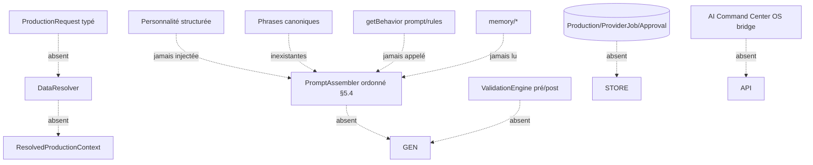
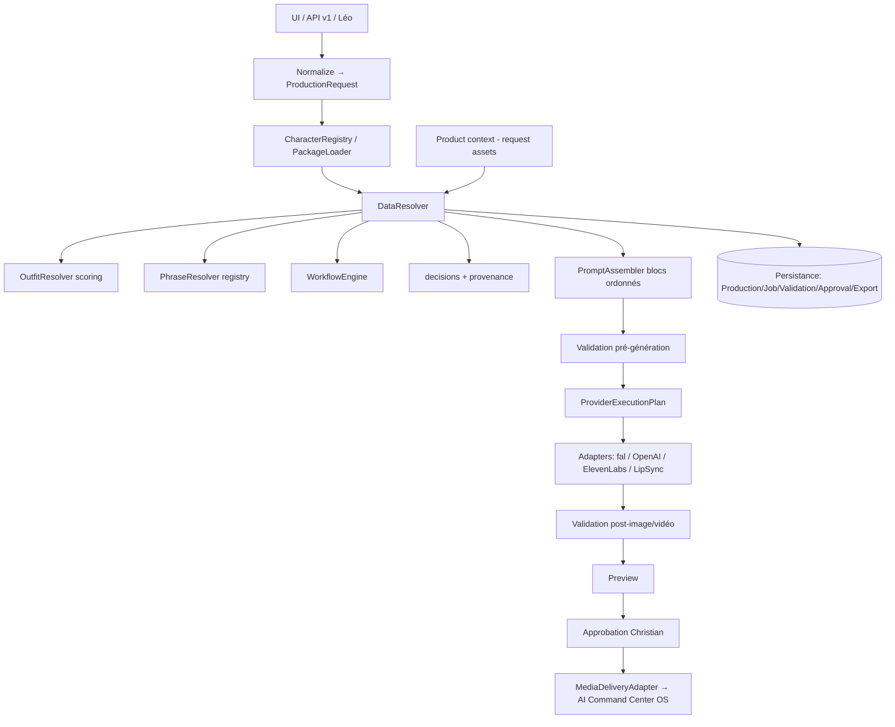

# RUNTIME DATA USAGE AUDIT — Phase 0

**Projet :** Virtual Humans SDK
**Personnage principal :** Mei (`Mei SDK v1.0.0`)
**Spécification de référence :** `VIRTUAL_HUMANS_CURSOR_FINAL_IMPLEMENTATION_SPEC.md`
**Type :** Audit en lecture seule — **aucune modification de code**
**Statut :** Livrable Phase 0 (audit + tickets prioritaires uniquement)

> Ce document répond aux 34 questions de la spec (§18 questions 1–17, §20.7 questions 18–34),
> fournit les diagrammes de flux (actuel / cassé / corrigé), localise les phrases de Mei,
> liste les données inutilisées / dupliquées / contradictoires, les fallbacks silencieux,
> la plus petite tranche verticale utile, et propose `FEATURE-VH-001`.

---

## 0. Résumé exécutif

Le constat central de la spec est **confirmé par le code** : le dépôt est une riche bibliothèque
de données de personnage, mais le **runtime ne consomme presque aucune de ces données dans la
génération**. Concrètement :

- La seule donnée SDK réellement injectée en génération est : **les images d'identité** (assets
  disque → upload fal → Seedance) et **la config voix** (`voice/config.json` → ElevenLabs).
- **Personnalité, behaviors, mémoires, phrases d'ouverture/fermeture, wardrobe structurée,
  standards `core/`, limitations, capacités** ne sont **jamais** injectés dans un prompt de
  production. `getCharacterOverview()` lit 4 docs mais **seulement pour l'affichage dashboard**.
- **Aucune entité « production »** n'est persistée. Seul `studio/.data/spend.json` (budget) existe.
- **Aucune intégration AI Command Center OS**, aucune API versionnée `/api/v1`, aucune
  authentification serveur-à-serveur, idempotence, ni transfert de média.
- Le **micro-trottoir** est un **preset de 7 prompts texte** avec « Mei » **en dur** ; il
  **n'existe aucune logique bi-locuteur / interview / dialogue / shot-plan**.
- Le **lip-sync fonctionne end-to-end** (fal) mais sur un **seul locuteur** et un **script texte libre**.

### ⚠️ Conflits de frontière produit à corriger (introduits récemment)

Deux éléments récents **contredisent la spec §21.4 / §21.6 / §25.1–25.2** (autoritative) :

1. **Bibliothèque `products/` sur disque** (`products/<id>/product.json` + `screens/`) via
   `saveProduct` / `addProductScreens` : la spec §25.1 dit que les captures d'app **appartiennent
   à AI Command Center OS** et que le SDK **ne doit pas** en être la source de vérité permanente.
   → À reclasser en **assets de requête / production** (snapshots), pas en registre permanent.
2. **Intention « insert téléphone scrollable »** du Studio Scène (`scene/page.tsx`, mention
   « pour l'insert téléphone à venir ») : la spec §21.4 / §25.2 réserve les mockups smartphone,
   scroll, tap/swipe, démos d'app scrollables à **Studio V2 (AI Command Center OS)**. Le SDK peut
   seulement **afficher une capture sur un écran tenu par Mei / en insert**, sans recréer Studio V2.
   → **Ne pas** implémenter le scroll-mockup dans le SDK.

Ces points ne sont **pas corrigés dans cet audit** (Phase 0 = lecture seule) ; ils deviennent des
tickets (voir §12).

---

## 1. Périmètre réel du dépôt (arborescence de haut niveau)

```text
virtual-humans/
├── VIRTUAL_HUMANS_CURSOR_FINAL_IMPLEMENTATION_SPEC.md   # spec officielle
├── core/                        # standards transverses (character-agnostic)
│   ├── CHARACTER_STANDARD.md  VIDEO_STANDARD.md  PHOTO_STANDARD.md
│   ├── PROMPT_STANDARD.md     QUALITY_STANDARD.md LEGAL_STANDARD.md
│   └── SOCIAL_STANDARD.md     README.md
├── characters/
│   └── Mei SDK v1.0.0/
│       ├── 00_IDENTITY.md … 26_VIDEO_MEMORY.md, 99_CHARACTER_LOCK.md   # 24 docs
│       ├── memory/            # 12 fichiers mémoire Mei (00→10 + README)
│       ├── prompts/           # system/ behavior/ templates/
│       ├── voice/config.json  # config voix (voiceId vide → fallback env)
│       └── assets/            # identity(15) expressions(11) poses(13) outfits(10 LOOK_*)
│                              # branding(vide) reference(vide) videos(gitkeep)
├── products/                  # ⚠ créé par le runtime (saveProduct) — voir conflit §0
├── studio/                    # application Next.js (UI + API + runtime)
│   ├── src/app/               # 10 pages + 18 routes API
│   ├── src/lib/               # sdk.ts, pricing.ts, budget.ts, assemble.ts, providers/…
│   ├── src/components/        # nav, prompt-composer, page-header
│   └── .data/spend.json       # seule persistance serveur
└── docs/
    ├── runtime/RUNTIME_DATA_USAGE_AUDIT.md   # ce document
    └── archive/…
```

**Stack :** Next.js `16.2.10`, React `19.2.4`, TypeScript `strict: true`, `@fal-ai/client ^1.10.1`.
**Validation :** **aucune** (pas de Zod / valibot / ajv). Alias `@/*` → `studio/src/*`.

---

## 2. Points d'entrée runtime & routes actuelles

### 2.1 Pages UI (`studio/src/app/**/page.tsx`)

| Route | Fichier | Rôle |
|---|---|---|
| `/` | `app/page.tsx` | Dashboard (overview SDK + clés + budget) |
| `/scene` | `app/scene/page.tsx` | Studio Scène (tenue+lieu+produit+script → Seedance) |
| `/products` | `app/products/page.tsx` | Bibliothèque apps (⚠ conflit frontière) |
| `/image` | `app/image/page.tsx` | Image OpenAI `gpt-image-1` |
| `/voice` | `app/voice/page.tsx` | Voix ElevenLabs |
| `/video` | `app/video/page.tsx` | Vidéo fal (Veo/Seedance/Runway/Kling/MiniMax) |
| `/lipsync` | `app/lipsync/page.tsx` | Lip-sync fal |
| `/storyboard` | `app/storyboard/page.tsx` | Storyboard 60s + preset micro-trottoir |
| `/budget` | `app/budget/page.tsx` | Historique dépenses |
| `/settings` | `app/settings/page.tsx` | Statut clés / SDK / tarifs |

### 2.2 Routes API (`studio/src/app/api/**/route.ts`)

Lecture SDK : `/api/characters`, `/api/character`, `/api/template`, `/api/assets`, `/api/asset`,
`/api/outfits`, `/api/video-models`, `/api/settings`, `/api/products`, `/api/product-screen`.
Génération : `/api/generate/image`, `/api/generate/voice`, `/api/generate/video`,
`/api/generate/lipsync`, `/api/generate/status`, `/api/generate/merge`, `/api/estimate`.
Budget : `/api/budget` (GET/DELETE).

> **Aucune route `/api/v1/...`**, aucune route `productions`, `resolve`, `approve`, `execute`,
> `export`, `health`, `production-requests`, ni endpoint d'intégration AI Command Center OS.

---

## 3. Réponses aux 34 questions de l'audit

### §18 — Questions 1 à 17

**1. Quel code gère une demande de production ?**
Aucun code « production » unifié. Chaque page compose son propre corps de requête et appelle
directement les routes `/api/generate/*`. Il n'existe **pas** de type `ProductionRequest`, ni de
`DataResolver`, ni de `ResolvedProductionContext`. La « demande » est un objet ad-hoc par page
(ex. `scene/page.tsx` → POST `/api/generate/video`).

**2. Quel code charge l'identité de Mei ?**
- Affichage : `getCharacterOverview()` (`studio/src/lib/sdk.ts`) lit `00_IDENTITY.md`,
  `01_APPEARANCE.md`, `02_PERSONALITY.md`, `04_VOICE.md` → **dashboard uniquement** (`app/page.tsx`).
- Génération : **images d'identité** via `listAssets()` / `readAsset()` (`sdk.ts`) → catégorie
  `identity` → `uploadBuffer()` (`providers/fal.ts`) → Seedance (`api/generate/video/route.ts`).
- Le **texte** de `00_IDENTITY.md` n'est **jamais** injecté dans un prompt de génération.

**3. Quel code charge `02_PERSONALITY.md` ?**
`getCharacterOverview()` en extrait un **excerpt** (~600 caractères) pour le dashboard. **Aucun**
autre code ne le lit. La personnalité **n'influence ni le script ni les prompts** de génération.

**4. Quel code charge les outfits et les `look.json` ?**
`listOutfits(character)` (`sdk.ts`) parse `assets/outfits/LOOK_*/look.json` (nom, clothing, style,
locations, best_for) + `look.png`/`thumbnail.png`. Exposé par `GET /api/outfits`.
**Consommateur unique : `app/scene/page.tsx`.** `look.md` n'est **jamais** lu.

**5. Quel code sélectionne un outfit ?**
- `scene/page.tsx` : sélection **manuelle** dans un `<select>` ; le premier outfit est présélectionné.
  Le `lookPath` choisi est ajouté aux `assetPaths` Seedance.
- `video/page.tsx` / `storyboard/page.tsx` : pas de notion d'outfit structuré ; les tenues
  apparaissent seulement comme images dans le picker d'assets brut (catégorie `outfits`).
- **Aucun résolveur automatique** (pas de scoring produit/canal/scène → outfit ; §7.4 de la spec absent).

**6. Quel code charge la phrase d'ouverture de Mei ?**
**Aucun.** Aucune phrase d'ouverture n'est chargée ni injectée. (Localisation des candidats : §4 ci-dessous.)

**7. Quel code charge la phrase de fermeture de Mei ?**
**Aucun.** Même constat.

**8. Quel code assemble le prompt final ?**
Deux mécanismes partiels, **non unifiés**, **sans ordre de blocs normatif (§5.4)** :
- `PromptComposer` (`components/prompt-composer.tsx`) + `assemble.ts`
  (`extractPromptBlock`, `extractVariables`, `fillTemplate`, `identityClause`) : template SDK +
  remplissage de variables + clause d'identité. Utilisé par `/image` et `/video`.
- `scene/page.tsx` : construit un prompt **en dur** dans un `useMemo` (chaîne concaténée).
- `storyboard/page.tsx` : prompts **texte libre** du preset.
Aucune provenance de prompt (`source ID/path/priority/inclusion reason`) n'est conservée.

**9. Quel code appelle les fournisseurs image/vidéo ?**
- Image : `generateImage()` (`providers/openai-image.ts`) → OpenAI `gpt-image-1`
  (`https://api.openai.com/v1/images/generations`) via `api/generate/image/route.ts`.
- Vidéo : `submitJob()` / `checkJob()` (`providers/fal.ts`, `@fal-ai/client`) via
  `api/generate/video/route.ts` + `api/generate/status/route.ts`.
- Voix : `generateVoice()` (`providers/elevenlabs-voice.ts`) → `eleven_multilingual_v2`.
- Lip-sync : `submitJob()` via `api/generate/lipsync/route.ts`.
- Merge : `submitJob(MERGE_MODEL_ID)` via `api/generate/merge/route.ts`.

**10. Quel code valide l'identité en sortie ?**
**Aucun.** Pas de validation post-image / post-vidéo (identity drift, outfit match, lip-sync score…).
Le prompt Seedance contient une **instruction textuelle** de cohérence (`@Image1…`), mais rien ne
**vérifie** le résultat.

**11. Quel code persiste les productions ?**
**Aucun.** Seul `budget.ts` persiste `studio/.data/spend.json` (entrées `SpendEntry`). Pas de
`Production`, `ProductionDecision`, `ProviderJob`, `ValidationReport`, `Approval`, `Export`.

**12. Quel code se connecte à AI Command Center OS ?**
**Aucun.** Aucun module `ai-command-center`, aucun endpoint d'ingestion, aucun `MediaDeliveryAdapter`.

**13. Quels fichiers de données sont actuellement inutilisés ?** (voir §6 pour la liste complète)
En pratique, **tout sauf** : `assets/identity/*` (Seedance), `assets/outfits/*/look.json` (Scène),
`voice/config.json` (voix), et les 4 docs lus en excerpt dashboard. Inutilisés en génération :
personnalité (contenu), behaviors (`getBehavior` jamais appelé), toutes les `memory/*`, tous les
`core/*`, `03_WARDROBE`, `05_CAMERA`, `06_BRAND`, `07_BEHAVIOR`, `08_PROMPTS`, `09_WORKFLOWS`,
`11_CAPABILITIES`, `12_LIMITATIONS`, `13`–`16`, `20`–`26`, `99_CHARACTER_LOCK`, `look.md`,
`assets/expressions`, `assets/poses` (hors picker manuel).

**14. Quelles données sont dupliquées ?**
- **Clause d'identité** : `assemble.ts` → `identityClause()` **et** `prompt-composer.tsx` → `IDENTITY()`
  définissent chacun leur propre texte de clause (doublon logique).
- **Mémoire média client** : `reflib.ts` (bibliothèque refs) et `media-store.ts` (dernière image/vidéo)
  se recouvrent partiellement (dernière image de référence).
- **Thèmes mémoire** : docs racine `21`–`26` (architecture) vs `memory/01`–`06` (données Mei) —
  **pas** une duplication de contenu, mais des thèmes parallèles ssource de confusion (voir §7).

**15. Quelles données sont contradictoires ?**
- **Phrases** : `02_PERSONALITY.md` fournit **plusieurs** exemples d'ouverture/fermeture **et**
  déconseille explicitement (§69) de **répéter** le même greeting → contradiction directe avec
  l'exigence spec §7.3 d'une **phrase canonique récurrente unique**. (Détail §4.)
- **Frontière produit** : le code récent (`products/`, intention insert-téléphone) contredit la
  spec §21/§25 (voir §0).

**16. Quels fallbacks runtime masquent des données manquantes ?** (interdits par spec §13.2)
- **Voix** : `generateVoice()` retombe **silencieusement** sur `process.env.ELEVENLABS_VOICE_ID`
  si `voice/config.json.voiceId` est vide (actuellement le cas pour Mei).
- **Nom personnage en dur** : `storyboard/page.tsx` (preset) et clauses écrivent « Mei » en dur au
  lieu de résoudre le personnage actif → masque l'absence de résolution.
- **Génération sans identité** : pour les modèles non-Seedance (Veo/Kling/MiniMax/Runway), la vidéo
  est générée **sans aucune référence d'identité** (texte seul) sans blocage ni avertissement →
  viole §7.1 (« text description alone is insufficient when reference assets are available »).
- **Personnalité générique implicite** : les scripts (voix, lip-sync, scène) sont du **texte libre**
  ; en l'absence d'injection de personnalité, le résultat prend un ton générique sans signal d'erreur.

**17. Quelle est la plus petite tranche verticale prouvant un usage correct des données ?**
**`FEATURE-VH-001` (voir §11) :** un `CharacterPackageLoader` + `CharacterRegistry` typés qui
chargent le package Mei complet (identité, personnalité structurée, outfits, phrases, mémoires,
capacités, limitations, refs d'assets) et un **écran/diagnostic** prouvant le chargement — **sans
toucher aux pipelines de génération existants**. C'est la fondation sur laquelle brancher ensuite
les workflows existants.

### §20.7 — Questions 18 à 34 (workflows existants)

**18. Où est implémenté le micro-trottoir ?**
`studio/src/app/storyboard/page.tsx` — constante `MICRO_TROTTOIR` (7 plans) + `loadPreset()`.

**19. Est-ce un workflow complet ou une orchestration UI ?**
**Orchestration UI uniquement.** C'est un preset de prompts texte affiché dans la page storyboard ;
la génération réutilise le pipeline vidéo générique + merge ffmpeg optionnel. Pas de workflow
serveur dédié.

**20. Comment l'intervieweur et l'interviewé sont-ils représentés ?**
Ils **ne le sont pas** structurellement. « Mei » et « passant » n'apparaissent que dans le **texte**
des prompts. Aucun `characterId` intervieweur, aucun modèle d'interviewé.

**21. Comment le dialogue est-il réparti entre locuteurs ?**
Il ne l'est pas. **Aucun** `DialogueSegment`, `speakerId`, ni découpage.

**22. Comment les voix sont-elles assignées ?**
Aucune assignation multi-locuteur. La voix (Studio Voix / Lip-sync) est **unique**, celle du
personnage actif via `voice/config.json` (fallback env).

**23. Où le lip-sync est-il exécuté ?**
`app/lipsync/page.tsx` (UI) → `api/generate/lipsync/route.ts` → fal via `submitJob()`.

**24. Quel fournisseur exécute le lip-sync ?**
fal.ai. Modèles `LIPSYNC_MODELS` (`pricing.ts`) : `veed/lipsync` (défaut) et `fal-ai/sync-lipsync/v3`.
Input fal : `{ video_url, audio_url }`.

**25. Comment les jobs lip-sync sont-ils persistés ?**
Ils **ne le sont pas** (hors `spend.json` pour le coût). Le suivi est **en mémoire client**
(polling `/api/generate/status`). Rien côté serveur.

**26. Comment les clips finaux sont-ils assemblés ?**
`api/generate/merge/route.ts` → `fal-ai/ffmpeg-api/merge-videos`, input `{ video_urls }`, min 2 clips.
Déclenché depuis `storyboard/page.tsx` → `assemble()`.

**27. Comment sont gérés erreurs et reprises ?**
Par page, côté client : statut `FAILED` affiché, polling stoppé. **Aucune** politique de retry
serveur, backoff, ni persistance d'échec. Le provider fal renvoie une erreur mappée par `checkJob()`.

**28. Comment l'identité est-elle préservée après lip-sync ?**
Elle **ne l'est pas vérifiée**. Aucun contrôle d'`identityDrift` post-lip-sync (spec §20.3 absent).

**29. Quelles parties fonctionnent end-to-end ?**
Image (OpenAI), Voix (ElevenLabs, voix personnage), Vidéo (fal, y compris Seedance identité),
Lip-sync (fal), Merge (fal ffmpeg), Estimation budget. Ces briques marchent isolément.

**30. Quelles parties contournent les données personnage documentées ?**
Micro-trottoir (nom en dur), scripts voix/lip-sync/scène (texte libre), plans storyboard
text-to-video (aucune identité), et **tous** les pipelines vis-à-vis de personnalité / behaviors /
mémoires / phrases / wardrobe structurée / standards `core/`.

**31. Le workflow peut-il charger la tenue et la personnalité de Mei ?**
Tenue : **partiellement** (Scène uniquement, sélection manuelle). Personnalité : **non** (jamais
injectée ; seul le **nom** d'un behavior est utilisé comme libellé de ton dans Scène).

**32. Peut-il injecter les phrases canoniques d'ouverture/fermeture ?**
**Non** — elles n'existent pas sous forme canonique et aucun code ne les injecte.

**33. AI Command Center OS peut-il déclencher ce workflow existant ?**
**Non** — aucune API d'intégration.

**34. Quel code doit être réutilisé dans le pipeline de production unifié ?**
`providers/fal.ts` (submit/status/upload), `providers/openai-image.ts`, `providers/elevenlabs-voice.ts`,
`pricing.ts` (catalogues + estimations), `budget.ts`, `sdk.ts` (lecture SDK), `assemble.ts`
(extraction template), les routes `/api/generate/*` (à envelopper, pas à réécrire), et le preset
`MICRO_TROTTOIR` (à convertir en définition de workflow).

---

## 4. Localisation exacte des phrases de Mei

**Verdict : aucune phrase d'ouverture/fermeture canonique unique. Pas de `data/phrases.json`.**

Candidats **OPENING** — `characters/Mei SDK v1.0.0/02_PERSONALITY.md` §67 « Greetings » :
- L.1722 : `Bonjour, je suis Mei.`
- L.1726 : `Bonjour et bienvenue.`
- L.1730 : `Aujourd'hui, je vais vous présenter…`
- ⚠ §69 (L.1769–1772) : « Mei must avoid repeating: the same greeting » → **répétition déconseillée**.

Candidat **OPENING brand-spécifique** — `06_BRAND.md` L.1370 :
- `Je suis Mei, votre guide virtuelle pour découvrir RideCloud.` (contexte RideCloud, pas global)

Candidats **CLOSING** — `02_PERSONALITY.md` §68 « Conclusions » :
- L.1754 : `Vous savez maintenant comment ajouter votre véhicule.` (contextuel véhicule)
- L.1758 : `Il ne vous reste plus qu'à essayer.`
- L.1762 : `À bientôt pour une nouvelle démonstration.`

**Conséquence spec §7.3 :** en l'état, la résolution de phrase **doit échouer visiblement**
(data-quality blocker) plutôt que d'inventer une phrase. Une **décision produit** est requise :
figer une ouverture + une fermeture canoniques (par contexte) dans un registre
`characters/Mei SDK v1.0.0/data/phrases.json`. → Ticket `FEATURE-VH-DATA-PHRASES` (§12).

---

## 5. Diagrammes de flux de données

### 5.1 Flux actuel (as-is)

```mermaid
flowchart TD
  U[Utilisateur / Page UI] -->|corps ad-hoc| G[/api/generate/*]
  U -->|prompt libre / preset| G
  subgraph SDK[Données SDK]
    ID[assets/identity/*]
    OUT[assets/outfits/*/look.json]
    VC[voice/config.json]
    DOCS[00..26, memory/, core/*]
  end
  ID -->|readAsset+uploadBuffer| G
  OUT -->|Scene uniquement, manuel| U
  VC -->|voice route| G
  DOCS -.->|excerpt dashboard seulement| DASH[/api/character → Dashboard]
  G --> P[Providers: OpenAI / fal / ElevenLabs]
  P --> OUTv[URL média]
  G --> SPEND[(studio/.data/spend.json)]
  DOCS -. NON INJECTÉ .-> G
```

### 5.2 Flux cassé (ce qui manque — « broken »)



### 5.3 Flux corrigé proposé (to-be, respectant la spec)



---

## 6. Données actuellement inutilisées par le runtime

| Donnée | Lu par le code ? | Injecté en génération ? |
|---|---|---|
| `assets/identity/*` | Oui (`listAssets`/`readAsset`) | **Oui** (Seedance) |
| `assets/outfits/*/look.json` | Oui (`listOutfits`) | Partiel (Scène, manuel) |
| `assets/outfits/*/look.md` | **Non** | Non |
| `assets/expressions/*`, `assets/poses/*` | Picker manuel (video/storyboard) | Non (pas de résolveur) |
| `voice/config.json` | Oui (`getVoiceConfig`) | **Oui** (voix) |
| `00_IDENTITY / 01_APPEARANCE / 02_PERSONALITY / 04_VOICE` | Excerpt dashboard | **Non** |
| `03_WARDROBE, 05_CAMERA, 06_BRAND, 07_BEHAVIOR, 08_PROMPTS, 09_WORKFLOWS` | Non | Non |
| `11_CAPABILITIES, 12_LIMITATIONS, 13–16, 20–26, 99_CHARACTER_LOCK` | Non | Non |
| `memory/*` (12 fichiers) | Non | Non |
| `core/*` (8 standards) | Non | Non |
| `prompts/behavior/*/prompt.md`+`rules.md` | `getBehavior()` **défini mais jamais appelé** | Non |
| `prompts/system/*` | `listSystemPrompts()` (liste titres, dashboard) | Non |
| `prompts/templates/*` | Oui (`PromptComposer`) | **Oui** (image/vidéo) |

---

## 7. Duplications & contradictions

- **Clause d'identité dupliquée** : `assemble.ts::identityClause()` vs `prompt-composer.tsx::IDENTITY()`.
- **Mémoire média client** : `reflib.ts` vs `media-store.ts` (recouvrement « dernière référence »).
- **Mémoire racine vs `memory/`** : `21_CHARACTER_MEMORY.md`…`26_VIDEO_MEMORY.md` (architecture SDK,
  character-agnostic) et `memory/01_CHARACTER_MEMORY.md`…`06_VIDEO_MEMORY.md` (données Mei, first-person)
  ont des **thèmes parallèles** — pas un doublon de contenu, mais un risque de confusion runtime :
  il faudra désigner **`memory/` comme couche de données** et `21`–`26`/`15` comme **specs d'architecture**.
- **Phrases contradictoires** : exemples multiples + interdiction de répétition (voir §4).
- **Frontière produit contradictoire** : `products/` + intention insert-téléphone vs spec §21/§25 (voir §0).

---

## 8. Fournisseurs & modèles (exacts)

| Domaine | Adapter | Modèle / endpoint |
|---|---|---|
| Image | `providers/openai-image.ts` | `gpt-image-1` — `api.openai.com/v1/images/generations` |
| Voix | `providers/elevenlabs-voice.ts` | `eleven_multilingual_v2` — `api.elevenlabs.io/v1/text-to-speech/{voiceId}` |
| Vidéo | `providers/fal.ts` (`@fal-ai/client`) | `fal-ai/veo3.1/fast`, `bytedance/seedance-2.0/reference-to-video`, `fal-ai/runway-gen3/turbo/image-to-video`, `fal-ai/kling-video/v2/master/text-to-video`, `fal-ai/minimax/hailuo-02/standard/text-to-video` |
| Lip-sync | `providers/fal.ts` | `veed/lipsync`, `fal-ai/sync-lipsync/v3` |
| Merge | `providers/fal.ts` | `fal-ai/ffmpeg-api/merge-videos` |

> Conforme spec §11 sur le principe d'adaptateur, mais **sans** interface `MediaProviderAdapter`
> normalisée (`capabilities()/validateJob()/estimate()/execute()/getStatus()`), et **sans**
> `LipSyncAdapter` explicite (§20.3). Les contraintes provider (ratios, durées) vivent dans
> `pricing.ts` (`VideoModel`) — acceptable, à formaliser en capabilities.

---

## 9. Écarts documentation ↔ code (synthèse)

| Exigence spec | État code |
|---|---|
| Runtime exécutable de personnage (§1) | ❌ données non injectées |
| `CharacterRegistry` / `CharacterPackageLoader` typés (§5.1–5.2) | ❌ absent (`sdk.ts` = lecture ad-hoc) |
| `DataResolver` + `decisions` (§5.3) | ❌ absent |
| `PromptAssembler` blocs ordonnés + provenance (§5.4) | ❌ partiel, sans ordre ni provenance |
| `WorkflowEngine` (§5.5) | ❌ absent (preset UI) |
| Capability/Limitation/Validation engines (§5.6–5.8) | ❌ absent |
| Priorités de données explicites (§6) | ❌ absent |
| Registre de phrases canoniques (§7.3) | ❌ absent + données non canoniques |
| Résolveur d'outfit avec scoring (§7.4) | ❌ absent (manuel) |
| Library service + AssetRecord + IDs stables (§8) | ❌ pas d'index, pas d'IDs stables |
| Pipeline production 15 étapes (§9) | ❌ absent |
| API AI Command Center OS `/api/v1/*` (§10, §22) | ❌ absent |
| Persistance productions (§12) | ❌ seul `spend.json` |
| Classes d'erreurs + no silent fallback (§13) | ❌ fallbacks silencieux présents |
| Tests unit/integration (§14) | ❌ aucun test |
| Séparation Studio V2 / SDK (§21, §25) | ⚠ violée par code récent |
| Micro-trottoir / interview / lip-sync préservés (§20) | ⚠ lip-sync OK ; micro-trottoir = preset ; interview inexistant |
| `strict` TS, éviter `any`, Zod (§17) | ✅ strict ; ❌ Zod absent |

---

## 10. Ce qu'il faut PRÉSERVER (ne pas réécrire)

- `providers/fal.ts`, `providers/openai-image.ts`, `providers/elevenlabs-voice.ts` (intégrations qui marchent).
- Routes `/api/generate/*` + `/api/generate/status` + `/api/generate/merge` (envelopper, pas réécrire).
- `pricing.ts` (catalogues + estimations), `budget.ts` (persistance dépense).
- `sdk.ts` (lecture) — **à étendre** vers un loader typé, pas à remplacer brutalement.
- Pages UI existantes (image, voice, video, lipsync, storyboard) — **raccorder** au runtime.
- Pipeline lip-sync (fonctionne E2E) et merge ffmpeg (fonctionne E2E).
- Preset `MICRO_TROTTOIR` — **convertir** en définition de workflow, garder le contenu.

---

## 11. Premier ticket — `FEATURE-VH-001`

### FEATURE-VH-001 — Load and Resolve Mei Character Package

**Objectif :** Introduire un runtime de package personnage typé, **sans modifier les pipelines de
génération**, et le **prouver par un écran diagnostic**.

**Périmètre (in) :**
- `CharacterRegistry` : `listCharacters()`, `getCharacter(id, version?)`,
  `getActiveCharacterVersion(id)`, `validatePackage(id, version)`.
- `CharacterPackageLoader` : charge en un `CharacterPackage` typé :
  identité, apparence, **personnalité structurée** (parse des blocs YAML de `02_PERSONALITY.md`
  L.105–126 et L.2050–2068), outfits (`listOutfits`), poses, expressions, mémoires (`memory/*`),
  capacités (`11`), limitations (`12`), **références d'assets d'identité** (chemins relatifs).
- Validation Zod des données lues (fichiers + JSON), **échec visible** si donnée requise absente
  (pas de fallback silencieux) → classes d'erreurs `CharacterPackageInvalidError`,
  `IdentityAssetMissingError`.
- **Data-quality report** : signaler l'absence de phrases canoniques (renvoie vers `FEATURE-VH-DATA-PHRASES`).
- Cache des manifests parsés + invalidation sur changement de fichier (mtime).
- Endpoint `GET /api/v1/characters/:id` + écran diagnostic `/characters/:id` (onglet Overview)
  affichant : version, statut, #outfits, #poses, #expressions, statut voix, assets d'identité
  détectés, **et** la liste des données chargées vs manquantes.

**Périmètre (out / non ce ticket) :** résolution de production, assemblage de prompt, génération,
API AI Command Center OS, correction des frontières `products/` (tickets séparés).

**Critères d'acceptation :**
- Un test/diagnostic prouve le chargement de : identité, personnalité (structurée), **les 10 outfits**,
  poses, expressions, mémoires, capacités, limitations, refs d'assets requises.
- Aucune donnée requise manquante n'est masquée : elle apparaît explicitement en « manquant/bloquant ».
- Aucune régression sur les pipelines existants (image/voice/video/lipsync/storyboard inchangés).
- `strict` respecté, **zéro `any`**, validation Zod sur les entrées disque/JSON.

**Preuve de done :** capture de l'écran diagnostic Mei + sortie de test listant toutes les sections chargées.

---

## 12. Backlog priorisé (tickets suivants, à valider un par un)

> Ordre aligné sur §16 et §23 de la spec, en **vertical slices**, tests + doc à chaque étape.

| ID | Titre | Dépend de | Phase spec |
|---|---|---|---|
| **VH-DATA-PHRASES** | Décision + registre `data/phrases.json` (ouverture/fermeture canoniques par contexte) — **bloquant données**, aucune invention | — | §7.3 |
| **VH-BOUNDARY-001** | Reclasser `products/` en **assets de requête/production** (pas source de vérité) + retirer l'intention « insert téléphone scrollable » du Studio Scène (frontière Studio V2) | — | §21/§25 |
| **VH-001** | Character Package Runtime (ci-dessus) | — | Phase 1 |
| **VH-002** | Library service + AssetRecord + IDs stables + scan (identité/outfits/poses/expressions) | VH-001 | Phase 2 |
| **VH-003** | OutfitResolver (scoring produit/canal/scène) + UI wardrobe (10 looks) | VH-002 | Phase 2/§7.4 |
| **VH-004** | PhraseResolver + injection ouverture/fermeture selon workflow | VH-DATA-PHRASES, VH-001 | Phase 3 |
| **VH-005** | `ProductionRequest` typé + `DataResolver` + `decisions` + preview (resolve sans générer) | VH-001..004 | Phase 4 |
| **VH-006** | `PromptAssembler` (blocs ordonnés §5.4 + provenance) + validation script | VH-005 | Phase 5 |
| **VH-007** | Adapters normalisés (`MediaProviderAdapter`, `LipSyncAdapter`) enveloppant fal/OpenAI/ElevenLabs existants | VH-005 | Phase 6 |
| **VH-008** | Persistance productions (Production/Job/Validation/Approval/Export) — SQLite/Postgres | VH-005 | §12 |
| **VH-009** | Raccorder workflows existants (micro-trottoir, storyboard, lip-sync, scène) au runtime unifié | VH-005..008 | Phase 2/§20 |
| **VH-010** | Interview / multi-speaker (DialogueSegment, speakerId, shot plan) — **nouveau**, sur base micro-trottoir | VH-009 | §20.2–20.6 |
| **VH-011** | API v1 AI Command Center OS (`/api/v1/*`, resolve/create/validate/approve/execute/export/health) + auth serveur-à-serveur + idempotence | VH-005..008 | Phase 7/§10 |
| **VH-012** | Media delivery (checksum SHA-256, `MediaDeliveryAdapter`, retry/backoff, ack, fallback manuel) + réception app-screenshots de Léo | VH-011 | Phase 4/§22/§25 |
| **VH-013** | End-to-end Scenario A (RideCloud Reel) + Scenario G (micro-trottoir) + tests d'intégration | tous | Phase 8/§14 |

---

## 13. Rappels de conformité (à respecter dès Phase 1)

- **Aucun fallback silencieux** (§13.2) : voix env, nom « Mei » en dur, génération sans identité →
  à convertir en erreurs/avertissements explicites.
- **IDs stables** comme clés runtime, jamais les libellés (§17.10).
- **Markdown = source de vérité** ; JSON/TS générés = cache, jamais remplacement silencieux (§2).
- **Ne jamais coder Mei en dur** dans un service générique (§17.11).
- **Studio V2 reste hors du SDK** (§21.4) ; captures d'app = assets de campagne (§25.1).
- **Aucune publication/transfert** sans approbation Christian (§9.14, §24).

---

*Fin de l'audit Phase 0. Aucun code n'a été modifié. Prochaine étape : validation de
`FEATURE-VH-001` (et arbitrage de `VH-DATA-PHRASES` / `VH-BOUNDARY-001`) avant implémentation.*
